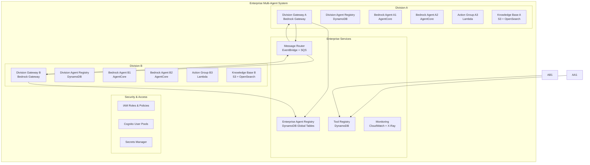

# Multi-Agent System Design Document

## Overview

This design document outlines the architecture for an enterprise multi-agent system deployed on AWS. The system enables each enterprise division to operate its own agent gateway while facilitating cross-division agent discovery and communication. The solution leverages AWS managed services for scalability, reliability, and security.

## Architecture

### High-Level Architecture

The system follows a federated architecture where each enterprise division operates independently while participating in a shared enterprise ecosystem:



### AWS Service Selection Rationale

- **Amazon Bedrock Gateway**: For division gateways - managed gateway service with native Bedrock integration, authentication, and scaling
- **Amazon Bedrock Agents (AgentCore)**: For intelligent agents - managed AI agents with built-in reasoning, tool integration, and conversation memory
- **Lambda**: For action groups and tool functions - cost-effective for event-driven, short-running tasks that extend agent capabilities
- **DynamoDB**: For registries - NoSQL database with global tables for cross-region replication
- **EventBridge**: For event routing - managed event bus for loose coupling between divisions
- **SQS**: For message queuing - reliable message delivery with dead letter queues
- **Cognito**: For authentication - managed user authentication and authorization integrated with Bedrock Gateway
- **CloudWatch/X-Ray**: For monitoring - comprehensive observability and distributed tracing
- **Amazon S3**: For knowledge bases and agent artifacts - storage for agent configurations and data
- **OpenSearch Serverless**: For vector search in knowledge bases - managed search service for RAG capabilities
- **AWS Systems Manager**: For parameter management - secure configuration storage

## Components and Interfaces

### Division Gateway

**Technology**: Amazon Bedrock Gateway with API Gateway
**Purpose**: Managed entry point for each division's agents and external requests

**Key Features**:
- Native integration with Bedrock Agents and Foundation Models
- Built-in authentication and authorization
- Automatic scaling and load balancing
- Integrated monitoring and logging
- Support for streaming responses and conversation sessions

**Bedrock Gateway Configuration**:
```json
{
  "gatewayName": "division-a-gateway",
  "divisionId": "division-a",
  "bedrockRegion": "us-east-1",
  "defaultFoundationModel": "anthropic.claude-3-sonnet-20240229-v1:0",
  "authenticationConfig": {
    "cognitoUserPoolId": "us-east-1_XXXXXXXXX",
    "allowedOrigins": ["https://division-a.company.com"]
  },
  "rateLimiting": {
    "requestsPerSecond": 100,
    "burstLimit": 200
  },
  "loggingConfig": {
    "cloudWatchLogGroup": "/aws/bedrock/gateway/division-a",
    "enableXRayTracing": true
  }
}
```

**API Endpoints** (Managed by Bedrock Gateway):
```
POST /agents/{agentId}/invoke - Invoke Bedrock agent
POST /agents/{agentId}/session - Start conversation session
GET /agents/{agentId}/session/{sessionId} - Get session status
POST /models/invoke - Direct foundation model invocation
GET /agents - List available agents
```

**Integration Points**:
- Direct integration with Bedrock Agents and Knowledge Bases
- Custom action groups for division-specific tools
- Cross-division communication through gateway federation

### Enterprise Agent Registry

**Technology**: DynamoDB with Global Secondary Indexes
**Purpose**: Centralized registry of all agents across divisions

**Data Model**:
```json
{
  "agentId": "division-a-agent-001",
  "divisionId": "division-a",
  "agentName": "DataAnalysisAgent",
  "agentType": "bedrock", // "bedrock" | "lambda" | "custom"
  "capabilities": ["data-analysis", "report-generation", "natural-language-query"],
  "endpoint": "https://division-a-gateway.example.com/agents/agent-001",
  "bedrockAgentId": "AGENT123456", // For Bedrock agents
  "bedrockAgentAliasId": "ALIAS789", // For Bedrock agents
  "foundationModel": "anthropic.claude-3-sonnet-20240229-v1:0",
  "isShareable": true,
  "permissions": ["division-b", "division-c"],
  "status": "active",
  "lastHeartbeat": "2024-01-15T10:30:00Z",
  "knowledgeBases": ["KB123456"],
  "actionGroups": ["DataAnalysisTools", "ReportingTools"],
  "metadata": {
    "version": "1.2.0",
    "runtime": "bedrock",
    "timeout": 300,
    "conversationMemory": true
  }
}
```

**Indexes**:
- GSI on divisionId for division-specific queries
- GSI on capabilities for capability-based discovery
- GSI on isShareable for cross-division discovery

### Message Router

**Technology**: EventBridge + SQS + Lambda
**Purpose**: Route messages between agents across divisions

**Message Flow**:
1. Agent sends message to Division Gateway
2. Gateway publishes event to EventBridge
3. EventBridge routes to appropriate SQS queue based on rules
4. Target Division Gateway consumes from queue
5. Gateway delivers message to target agent

**Message Format**:
```json
{
  "messageId": "msg-12345",
  "sourceAgentId": "division-a-agent-001",
  "targetAgentId": "division-b-agent-002",
  "messageType": "request",
  "payload": {},
  "timestamp": "2024-01-15T10:30:00Z",
  "correlationId": "corr-67890",
  "ttl": 3600
}
```

### Tool Registry

**Technology**: DynamoDB with Lambda-based tool execution
**Purpose**: Manage available tools and their execution

**Tool Definition**:
```json
{
  "toolId": "data-transformer-v1",
  "name": "Data Transformer",
  "description": "Transforms data between formats",
  "version": "1.0.0",
  "runtime": "lambda",
  "functionArn": "arn:aws:lambda:us-east-1:123456789:function:data-transformer",
  "inputSchema": {},
  "outputSchema": {},
  "timeout": 300,
  "permissions": ["division-a", "division-b"]
}
```

### Agent Implementation Patterns

**Amazon Bedrock Agents (Primary Pattern)**:
- Fully managed AI agents with built-in reasoning capabilities
- Integration with Foundation Models (Claude, Llama, etc.)
- Built-in conversation memory and context management
- Native tool integration and action groups
- Knowledge base integration for RAG (Retrieval Augmented Generation)
- Automatic prompt engineering and orchestration

**Bedrock Agent Configuration**:
```json
{
  "agentName": "DivisionAnalysisAgent",
  "foundationModel": "anthropic.claude-3-sonnet-20240229-v1:0",
  "instruction": "You are a data analysis agent for Division A. Help users analyze business data and generate insights.",
  "actionGroups": [
    {
      "actionGroupName": "DataAnalysisTools",
      "description": "Tools for data analysis and reporting",
      "actionGroupExecutor": {
        "lambda": "arn:aws:lambda:us-east-1:123456789:function:data-analysis-tools"
      },
      "apiSchema": {
        "s3": {
          "s3BucketName": "agent-schemas",
          "s3ObjectKey": "data-analysis-schema.json"
        }
      }
    }
  ],
  "knowledgeBases": [
    {
      "knowledgeBaseId": "KB123456",
      "description": "Division A business knowledge base"
    }
  ]
}
```

**Lambda-based Custom Agents**:
- Stateless, event-driven agents for specific tasks
- Integration with Bedrock Agents as action groups
- Cost-effective for simple, deterministic operations
- Custom business logic not suitable for AI agents

**Agent Orchestration Patterns**:
- Bedrock Agents can invoke other Bedrock Agents through action groups
- Custom Lambda functions serve as bridges between different agent types
- Division Gateways coordinate multi-agent workflows

## Data Models

### Agent Registration Model
```python
class AgentRegistration:
    agent_id: str
    division_id: str
    agent_name: str
    capabilities: List[str]
    endpoint: str
    is_shareable: bool
    permissions: List[str]
    runtime_type: str  # 'lambda' | 'ecs' | 'external'
    health_check_endpoint: str
    metadata: Dict[str, Any]
```

### Message Model
```python
class AgentMessage:
    message_id: str
    source_agent_id: str
    target_agent_id: str
    message_type: str  # 'request' | 'response' | 'event'
    payload: Dict[str, Any]
    correlation_id: Optional[str]
    timestamp: datetime
    ttl: int
    retry_count: int = 0
```

### Tool Execution Model
```python
class ToolExecution:
    execution_id: str
    tool_id: str
    requesting_agent_id: str
    input_parameters: Dict[str, Any]
    status: str  # 'pending' | 'running' | 'completed' | 'failed'
    result: Optional[Dict[str, Any]]
    error_message: Optional[str]
    started_at: datetime
    completed_at: Optional[datetime]
```

## Error Handling

### Circuit Breaker Pattern
- Implement circuit breakers in Division Gateways
- Fail fast when downstream services are unavailable
- Automatic recovery when services become healthy

### Retry Mechanisms
- Exponential backoff for transient failures
- Dead letter queues for failed messages
- Maximum retry limits to prevent infinite loops

### Error Response Format
```json
{
  "error": {
    "code": "AGENT_UNAVAILABLE",
    "message": "Target agent is currently unavailable",
    "details": {
      "agentId": "division-b-agent-002",
      "retryAfter": 300
    },
    "timestamp": "2024-01-15T10:30:00Z"
  }
}
```

## Testing Strategy

### Unit Testing
- Test individual components in isolation
- Mock AWS services using LocalStack or AWS SDK mocks
- Focus on business logic and error handling

### Integration Testing
- Test component interactions within each division
- Validate cross-division communication flows
- Use AWS testing environments with real services

### End-to-End Testing
- Test complete workflows across multiple divisions
- Validate agent discovery and invocation scenarios
- Performance testing under load

### Monitoring and Observability
- CloudWatch metrics for all components
- X-Ray distributed tracing for request flows
- Custom dashboards for division-specific metrics
- Automated alerting for system health issues

## Security Considerations

### Authentication and Authorization
- Cognito User Pools for agent authentication
- IAM roles for service-to-service communication
- Fine-grained permissions for cross-division access

### Network Security
- VPC isolation for each division
- Security groups restricting network access
- API Gateway with WAF for external access

### Data Protection
- Encryption at rest using AWS KMS
- Encryption in transit using TLS
- Secrets management using AWS Secrets Manager

### Audit and Compliance
- CloudTrail for API call logging
- VPC Flow Logs for network monitoring
- Compliance with enterprise security policies
### Be
drock Agent Integration

**Agent Creation and Management**:
- Each division can create and manage Bedrock Agents through the Division Gateway
- Agents are configured with division-specific instructions and knowledge bases
- Action groups connect agents to Lambda functions and external APIs

**Knowledge Base Integration**:
- Division-specific knowledge bases stored in S3
- OpenSearch Serverless for vector search capabilities
- Automatic document ingestion and embedding generation
- RAG capabilities for context-aware responses

**Cross-Division Agent Communication**:
- Bedrock Agents can invoke agents in other divisions through action groups
- Bedrock Gateway provides native federation capabilities for cross-division calls
- Session management maintains conversation context across agent interactions
- Built-in authentication and authorization for secure cross-division access

**Action Group Architecture**:
```json
{
  "actionGroupName": "CrossDivisionCommunication",
  "description": "Enables communication with agents in other divisions",
  "actionGroupExecutor": {
    "lambda": "arn:aws:lambda:us-east-1:123456789:function:cross-division-proxy"
  },
  "apiSchema": {
    "payload": {
      "type": "object",
      "properties": {
        "targetDivision": {"type": "string"},
        "targetAgent": {"type": "string"},
        "message": {"type": "string"},
        "context": {"type": "object"}
      }
    }
  }
}
```

**Bedrock Agent Workflow Example**:
1. User sends natural language request to Division A Gateway
2. Gateway routes to appropriate Bedrock Agent
3. Agent processes request using foundation model reasoning
4. If needed, agent invokes action groups (tools/other agents)
5. Agent synthesizes response using conversation memory
6. Response returned through Gateway to user

**Foundation Model Selection**:
- Claude 3 Sonnet for complex reasoning and analysis
- Claude 3 Haiku for fast, lightweight interactions
- Llama 2/3 for cost-optimized scenarios
- Custom fine-tuned models for domain-specific tasks### 
Bedrock Gateway Federation

**Gateway-to-Gateway Communication**:
- Each division's Bedrock Gateway can communicate with other division gateways
- Built-in service discovery for cross-division agent lookup
- Automatic load balancing and failover between gateway instances
- Integrated security with IAM roles and resource-based policies

**Federation Configuration**:
```json
{
  "federationConfig": {
    "enableCrossDivisionAccess": true,
    "trustedDivisions": [
      {
        "divisionId": "division-b",
        "gatewayEndpoint": "https://bedrock-gateway-division-b.amazonaws.com",
        "allowedAgents": ["*"],
        "permissions": ["invoke", "discover"]
      }
    ],
    "federationRole": "arn:aws:iam::123456789:role/BedrockGatewayFederationRole"
  }
}
```

**Benefits of Bedrock Gateway**:
- **Managed Infrastructure**: No need to manage ECS clusters or load balancers
- **Native Bedrock Integration**: Direct integration with agents, models, and knowledge bases
- **Built-in Security**: Integrated authentication, authorization, and encryption
- **Automatic Scaling**: Handles traffic spikes without manual configuration
- **Monitoring**: Built-in CloudWatch metrics and X-Ray tracing
- **Cost Optimization**: Pay-per-use pricing model with no idle costs